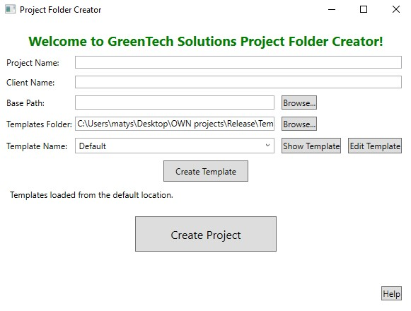

# Project Folder Creator



## Overview

The Project Folder Creator is a WPF application that helps you create a structured folder system for your projects based on predefined templates. It allows you to easily manage and organize project-related files.

## How to Start the Application

1. **Navigate to the Release Folder**:
   - After cloning the application, go to the folder path:
     ```
     \ProjectFolderCreatorWPF\Release
     ```
   - Here, you will find the necessary files for running the application.
   -
2. **Start the Application**:
   - Locate the `ProjectFolderCreatorWPF.exe` file in the folder and double-click it to run the application.
   - The app will start, and you can begin using it to create project folders based on templates.

## Folder Structure

- The `Release` folder contains all the necessary files for running the application.
- The `Templates` folder (if not already present) will be created in the same directory as the executable. This folder is used to store template JSON files for different project folder structures.

## Code File Descriptions

### `MainWindow.xaml.cs`

- **Purpose**: Handles the main application logic and user interface interactions.
- **Key Functions**:
  - `BrowseButton_Click`: Allows users to select the base path for the project.
  - `BrowseTemplatesButton_Click`: Lets users choose the templates folder and updates the templates list.
  - `SetDefaultTemplatesPath`: Sets the default path for the templates folder and creates it if it doesn't exist.
  - `CreateProjectButton_Click`: Creates the project folder structure based on the selected template.
  - `HelpButton_Click`: Displays a help message with instructions on how to use the app.

### `TemplateManager.cs`

- **Purpose**: Manages template-related functionalities, such as loading, creating, editing, and displaying templates.
- **Key Functions**:
  - `SetDefaultTemplatesPath`: Sets up the default templates folder path relative to the executable location.
  - `LoadTemplates`: Loads all JSON templates from the specified folder.
  - `ShowTemplate`: Displays the contents of the selected template.
  - `EditTemplate`: Allows editing of the folder names in the selected template.
  - `CreateTemplate`: Adds a new template with a custom folder structure.
  - `CreateProject`: Creates the project folders based on the selected template.

### `PathManager.cs`

- **Purpose**: Provides utility functions for managing file paths and directory selection.
- **Key Functions**:
  - `BrowseForFolder`: Opens a folder selection dialog for the user to choose a directory.

### `MainWindow.xaml`

- **Purpose**: Defines the layout and appearance of the user interface using XAML.
- **Key Components**:
  - `Grid`: Organizes the layout of controls in rows and columns.
  - `Buttons`, `TextBoxes`, `ComboBox`, and `TextBlocks`: Provide the interface for user input and output.
  - `Background`, `Foreground`, and other styling properties are used to customize the appearance.

## Features

- **Create Project**: Generate a project folder structure based on a selected template.
- **Show Template**: View the folder structure of a selected template.
- **Edit Template**: Modify the folder names in a selected template.
- **Create Template**: Add a new template with a custom folder structure.
- **Help**: Get information on how to use the application.

## How to Use

1. **Enter Project and Client Names**

   - Fill in the "Project Name" and "Client Name" fields.

2. **Select the Base Path**

   - Click the "Browse..." button next to the "Base Path" field to choose where the project folders should be created.

3. **Select the Templates Folder**

   - If needed, click the "Browse..." button next to the "Templates Folder" field to change the folder where templates are stored.

4. **Choose a Template**

   - Select a template from the dropdown list. You can view the template structure using the "Show Template" button, edit it using the "Edit Template" button, or create a new template using the "Create Template" button.

5. **Create the Project**
   - Click the "Create Project" button. The application will generate the folder structure based on the selected template.

## Requirements

- .NET 6 or higher
- Windows operating system (WPF application)

## Installation

1. **Clone or download the repository**.
2. **Open the project in Visual Studio**.
3. **Build the project** to generate the executable files in the `Release` folder.
4. **Follow the instructions under "How to Start the Application"** to run the app.
